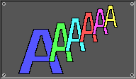

# 

AAAAXY is a nonlinear puzzle platformer taking place in non-Euclidean
geometry.

Although your general goal is reaching the surprising end of the game,
you are encouraged to setting your own goals while playing. Exploration
will be rewarded, and secrets await you\!

So jump and run around, and enjoy losing your sense of orientation in
this World of Wicked Weirdness. Find out what Van Vlijmen will make you
do. Pick a path, get inside a Klein Bottle, recognize some memes, and by
all means: don't look up.

## Screenshots

[](docs/screenshots/shot1.png)
[](docs/screenshots/shot2.png)
[](docs/screenshots/shot3.png)
[](docs/screenshots/shot4.png)
[](docs/screenshots/shot5.png)
[](docs/screenshots/shot6.png)
[](docs/screenshots/shot7.png)
[](docs/screenshots/shot8.png)

## Input

AAAAXY can be played with a keyboard or any controller good enough for
playing NES games. While the controls do follow usual standards set by
two dimensional games of the past, some details are to be guessed by the
player and experimented with.

The game menu can, of course, be reached using the Escape key or the
Start button.

If your gamepad is not supported yet, you can typically make it work by
putting its definition in the `SDL_GAMECONTROLLERCONFIG` environment
variable.

## Installing

AAAAXY is released in binary form as a zip file containing
self-contained executables for each supported platform.

So just extract the game executable to a convenient place and run it
from there\!

## Compiling

To build the game for yourself, install `git`, `golang`, `graphviz`,
`imagemagick` and `pandoc`, and then run:

``` sh
git clone https://github.com/divVerent/aaaaxy
cd aaaaxy
git submodule update --init --remote
make
```

NOTE: On FreeBSD systems, use `gmake` instead of `make` to compile.

To update and rebuild, run:

``` sh
cd aaaaxy
git pull
git submodule update --remote
make
```

You can also immediately compile and run the game using:

``` sh
make run
```

## Video Recording

To record a video of the game, pass the flags `-dump_video=video.raw
-dump_audio=audio.raw`. Then play normally. When you then exit the game,
the console window will show you a FFmpeg command to turn these files
into a finished video\!

Video recording can be sped up by using `make FASTER_VIDEO_DUMPING=true`
when compiling.

## Data Storage

AAAAXY stores saved games in the following location:

  - Windows: `Saved Games/AAAAXY`
  - Linux: `~/.local/share/AAAAXY`

Configuration is stored as follows:

  - Windows: `AppData/Local/AAAAXY`
  - Linux: `~/.config/AAAAXY`

It is recommended to back up these files.

## Save States

TODO(divVerent): Fix.

At the moment there is no menu to select save states; to play a
particular save state, please run the game binary with a command line
argument such as `-save_state=1` to select the save state with index 1.
The default save state can be switched to by passing `-save_state=0`.

Save states record progress at checkpoints only and the game
automatically saves when hitting one.

## Mathematical Notes

This game does not take place in the Euclidean space you're used to -
instead, you are experiencing the universal cover of a massively twisted
space. This is rather similar to seamless portals, but yields stronger
immersion and is generally an interesting approach I wanted to try out.
In particular, gravity behaves consistently across portals, and objects
are entirely glitch-free around them. On the other hand, this approach
can not support multi-player games; a more traditional portal based
engine would be more appropriate there, where the same object may be
seen multiple times on the screen. Sadly that approach would appear
rather confusing in places where this would cause the player themselves
to show up multiple times at once, which is why I did not go with it.

In 3D games with transparent portals/warpzones, immersion is usually
achieved by treating each portal as a dynamic texture surface which
shows a view out of a camera projected to the other side. An open source
implementation of this can e.g. be found in
[Xonotic](https://www.xonotic.org). The reason why this works is that
only those parts of an object are shown that have a line of sight to the
player - as expected in a first person game. Implementing a third person
view that way is already a bit more tricky but usually one can work
around the view origin mismatching but being close to the player origin;
however what is usually not possible with transparent portals in a
top-down or other 2D-ish view, as conflicting (e.g. self-overlapping)
geometry may need to be rendered to the screen at the same time.

There are however two approaches to solve this:

  - Design levels so that conflicting geometry is never on screen.
      - In other words, when transparently teleporting in order to move
        the player past a portal, a screen-sized environment of the
        source position must always match a screen-sized environment of
        the destination position.
      - This approach is simple and very immersive and has already been
        used in the original Super Mario Bros. game on the NES.
      - It however is not very flexible as any non-Euclidean geometry
        has to be rather large and behave fully Euclidean on every
        screen-sized environment around positions the player can visit.
  - Hide anything that has no line of sight to the player.
      - This actually matches the approach used in first person 3D games
      - With this approach, the game needs to be consistent with
        Euclidean geometry only in small environments around each
        object.
          - In this implementation, the consistency requirement is that
            an 1-tile environment around every portal must match, and
            that the same "screen tile" cannot be reached by a 1-tile
            environment around a line of sight through two different
            sets of portals at the same time.
          - As this game demonstrates, this can yield rather interesting
            while still obvious non-Euclidean geometry.
      - This is the approach has been explored in this game as well -
        but very likely for the first time in a two dimensional game.

## License

This project is released under the [Apache 2.0 License](LICENSE).

## Disclaimer

This is not an officially supported Google product.
