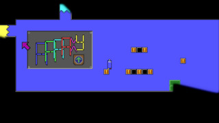
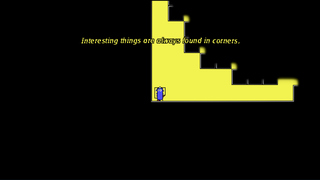
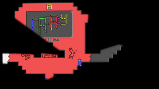
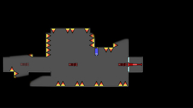
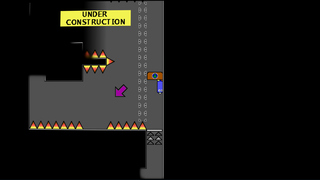
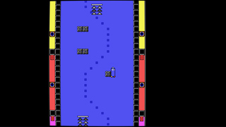

## 

AAAAXY is a nonlinear 2D puzzle platformer taking place in impossible
spaces.

Although your general goal is reaching the surprising end of the game,
you are encouraged to set your own goals while playing. Exploration will
be rewarded, and secrets await you!

So jump and run around, and enjoy losing your sense of orientation in
this World of Wicked Weirdness. Find out what Van Vlijmen will make you
do. Pick a path, get inside a Klein Bottle, recognize some memes, and by
all means: don't look up.

And beware of a minor amount of trolling.

To reach the end, a new player will take about 4 to 6 hours, a full
playthrough can be finished in about 1 hour and the end can be reached
in about 15 minutes.

The game is available for the following platforms:

| Platform     | Downloads                                                                                                                                                                                                           |
|--------------|---------------------------------------------------------------------------------------------------------------------------------------------------------------------------------------------------------------------|
| Android      | [F-Droid](https://f-droid.org/en/packages/io.github.divverent.aaaaxy/), [Google Play](https://play.google.com/store/apps/details?id=io.github.divverent.aaaaxy)                                                     |
| HTML5 (slow) | [netcup](https://rm.cloudns.org/aaaaxy/current/aaaaxy.html)                                                                                                                                                         |
| iOS          | [App Store](https://apps.apple.com/us/app/aaaaxy/id6447063878)                                                                                                                                                      |
| Linux        | [Flathub](https://flathub.org/apps/details/io.github.divverent.aaaaxy), [GitHub](https://github.com/divVerent/aaaaxy/releases), [Itch](https://divverent.itch.io/aaaaxy), [Snap Store](https://snapcraft.io/aaaaxy) |
| macOS        | [GitHub](https://github.com/divVerent/aaaaxy/releases), [Itch](https://divverent.itch.io/aaaaxy)                                                                                                                    |
| Windows      | [GitHub](https://github.com/divVerent/aaaaxy/releases), [Itch](https://divverent.itch.io/aaaaxy)                                                                                                                    |

Available languages: Chinese (Simplified), English, German, Latin,
Portuguese and Ukrainian.

### Direct Downloads

<!-- BEGIN DOWNLOAD LINKS TEMPLATE
The current version is VERSION. Download here:

  - [Windows x86_64 ZIP](https://github.com/divVerent/aaaaxy/releases/download/VERSION/aaaaxy-windows-amd64-VERSION.zip)
  - [Windows x86 ZIP](https://github.com/divVerent/aaaaxy/releases/download/VERSION/aaaaxy-windows-386-VERSION.zip)
  - [Linux x86_64 AppImage](https://github.com/divVerent/aaaaxy/releases/download/VERSION/AAAAXY-x86_64.AppImage)
  - [Linux x86_64 ZIP](https://github.com/divVerent/aaaaxy/releases/download/VERSION/aaaaxy-linux-amd64-VERSION.zip)
  - [macOS x86_64+M1 ZIP](https://github.com/divVerent/aaaaxy/releases/download/VERSION/aaaaxy-darwin-VERSION.zip)
  - [All files and releases](https://github.com/divVerent/aaaaxy/releases)
END DOWNLOAD LINKS TEMPLATE -->

<!-- BEGIN DOWNLOAD LINKS -->

The current version is v1.4.8. Download here:

-   [Windows x86_64
    ZIP](https://github.com/divVerent/aaaaxy/releases/download/v1.4.8/aaaaxy-windows-amd64-v1.4.8.zip)
-   [Windows x86
    ZIP](https://github.com/divVerent/aaaaxy/releases/download/v1.4.8/aaaaxy-windows-386-v1.4.8.zip)
-   [Linux x86_64
    AppImage](https://github.com/divVerent/aaaaxy/releases/download/v1.4.8/AAAAXY-x86_64.AppImage)
-   [Linux x86_64
    ZIP](https://github.com/divVerent/aaaaxy/releases/download/v1.4.8/aaaaxy-linux-amd64-v1.4.8.zip)
-   [macOS x86_64+M1
    ZIP](https://github.com/divVerent/aaaaxy/releases/download/v1.4.8/aaaaxy-darwin-v1.4.8.zip)
-   [All files and
    releases](https://github.com/divVerent/aaaaxy/releases)

<!-- END DOWNLOAD LINKS -->

### Try Online!

There is also a bleeding edge [WebAssembly
build](https://rm.cloudns.org/aaaaxy/current/aaaaxy.html).

Note that this is very experimental and may be too slow for many
computers. For full performance, please use the installable builds
above.

### Further Resources

-   [User Guide](userguide.md)
-   [Technical Support](https://github.com/divVerent/aaaaxy/issues)
-   [Discussion Forum](https://github.com/divVerent/aaaaxy/discussions)
-   [Chat](https://matrix.to/#/#aaaaxy:matrix.org)
-   [Pull Requests](https://github.com/divVerent/aaaaxy/pulls)
-   [Speedrunning](speedrunning.md)
-   [Music](music.md)

### Screenshots

### More Information

See also the game's [itch.io page](https://divVerent.itch.io/aaaaxy).

Deeper technical information and source code is to be found on the
[GitHub repository](https://github.com/divVerent/aaaaxy).

### Privacy

For information about this game's data collection and handling, you can
[see here](privacy.md).
